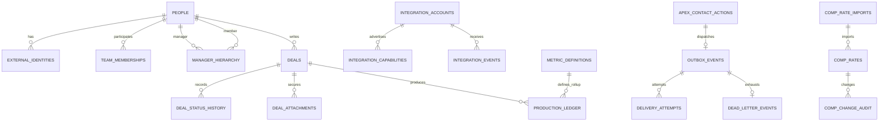

# APEX Canonical Data Model

The first migration is additive. It does not delete legacy tables or infer identity merges. Existing IDs are retained through `external_identities`; all uncertain matches require review.

## Identity

- `people` is canonical human identity, with archive state and normalized contact uniqueness indexes.
- `external_identities` maps provider/type/value to one person; provider/type/value is unique.
- `team_memberships` and `manager_hierarchy` are effective-dated. They preserve historical ownership.
- Resolution priority: canonical/external ID, validated PA number, validated NPN, verified normalized email, phone plus corroborating name/state, then manual review.
- Name-only matching is forbidden. Merge tooling must preview impact, transact, retain aliases, and support reversal.

## Production

- Existing `deals` evolves in place with native source, idempotency, policy/application, premium, workflow, correlation, and optimistic-version fields.
- `deal_drafts` stores recoverable section payloads server-side; browser storage contains only the draft idempotency key.
- `deal_status_history` is append-only business history.
- `deal_attachments` stores private object paths and scan/review state, not public URLs.
- `production_ledger` is immutable production truth for native approved/issued/in-force events and chargeback reversals. Unique `(deal_id,event_type)` prevents duplicate accounting.

## Compensation

- `comp_rate_imports` records signed workbook import provenance and status.
- `comp_rates` is effective-dated and idempotent by durable external change ID.
- `comp_change_audit` preserves before/after state.
- Authenticated users can read authorized values; no browser/web compensation mutation exists. Only the controlled sync service may write.

## Integration and delivery

- `integration_accounts` separates provider/environment configuration from people.
- `integration_capabilities` records supported/read-only/manual capabilities with verification time.
- `integration_events` retains inbound/outbound receipt hashes and status without raw secrets.
- `outbox_events` is unique by aggregate/event/destination/idempotency key.
- `delivery_attempts` and `dead_letter_events` retain recovery evidence.
- `apex_contact_actions` stores the authorized subject, server-resolved recipient snapshot, editable content, idempotency key, provider receipt, delivery truth, and audit linkage. Outbox payloads carry the action ID rather than recipient PII.

## RLS and service boundaries

Users read their own person/agent data, effective hierarchy, and authorized downline. Admins read agency scope. Service role owns worker/import mutations. Helper predicates are security-definer functions with fixed `search_path`. Grants do not replace row-level policies.

## Backfill invariants

- Preserve every source ID and source hash.
- Never rewrite legacy history to fit the canonical model.
- Record match rule and confidence for every link.
- Reconcile counts, premiums, and ownership before and after each bounded batch.
- Quarantine collisions and orphan references; never silently choose a winner.
